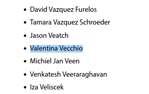

The ATLAS collaboration, together with the other experiments at CERN's Large Hadron Collider, was awarded the [2025 Breakthrough Prize](https://breakthroughprize.org/Laureates/1/L3993) for:

> For detailed measurements of Higgs boson properties confirming the symmetry-breaking mechanism of mass generation, the discovery of new strongly interacting particles, the study of rare processes and matter-antimatter asymmetry, and the exploration of nature at the shortest distances and most extreme conditions at CERN’s Large Hadron Collider.

Having been member of this collaboration for almost 10 years I am also among the recipients!

These last years were quite busy so it is hard to pin down a complete list of contributions. 
I can tell you the two main ones of which I am mostly proud:
- Design of the first measurement of the Higgs boson production in association with a single top-quark with the ATLAS detector.
- Derived data-driven estimation of the first Trasformer based Flavour Tagging algorithm.
